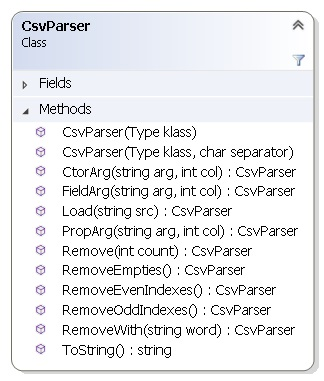
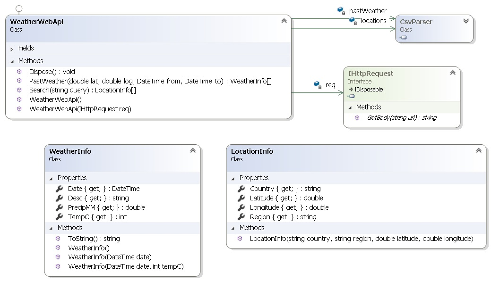

# Enunciado do Trabalho 1

**Data limite de entrega: 29 de Março**

Pretende-se desenvolver uma biblioteca **Csvier** para processamento de dados em
formato CSV. Esta biblioteca disponibiliza uma classe `CsvParser` com a API
pública apresentada no diagrama seguinte:



O exemplo seguinte demonstra um caso de utilização desta classe para
processamento de dados meteorológicos fornecidos pelo serviço [world weather
online](https://www.worldweatheronline.com/developer/api/docs/local-city-town-weather-api.aspx).

```csharp
string weatherJanuaryInLisbon = ...;
CsvParser pastWeather = new CsvParser(typeof(WeatherInfo))
                .CtorArg("date", 0)
                .CtorArg("tempC", 2)
                .PropArg("PrecipMM", 11)
                .PropArg("Desc", 10);
object[] items = pastWeather
                    .Load(weatherJanuaryInLisbon)
                    .RemoveWith("#")
                    .Remove(1)
                    .RemoveEvenIndexes()
                    .Parse();
```

Pode obter os dados referentes ao exemplo anterior a partir do seguinte URL
substituindo `***` por uma chave que deve obter ao registar-se no serviço world
weather online:

http://api.worldweatheronline.com/premium/v1/past-weather.ashx?q=37.017,-7.933&date=2019-01-01&enddate=2019-01-30&tp=24&format=csv&key=**********************

Os métodos de `CsvParser` têm o seguinte comportamento:
* `CsvParser(Type klass, char separator)` – `klass` representa a classe alvo a
  instanciar e `separator` o carácter separador das colunas nos dados CSV. Este
  último é vírgula (`,`) por omissão.
* `CtorArg(string name, int col)` – associa o parâmetro `name` do construtor com a
  coluna de índice `col` dos dados CSV.
* `PropArg(string name, int col)` – associa a propriedade `name` com a coluna de
  índice `col` dos dados CSV.
* `FieldArg(string name, int col)` – associa o campo `name` com a coluna de índice
  `col` dos dados CSV.
* `Load(string data)` – lê e carrega os dados de `data` dividindo por linhas.
* `RemoveWith(string word)` – Remove todas as linhas que comecem com a string
  `word`.
* `Remove(int count)` – Remove um número de linhas iniciais igual `count`.
* `RemoveEvenIndexes()` – Remove as linhas de índice par (0, 2, 4,…)
* `RemoveOddIndexes()` – Remove as linhas de índice ímpar (1, 3, 5,…)
* `RemoveEmpties()` – Remove as linhas vazias, iguais a `“”`.
* `Parse():object[]` – Retorna um array com instâncias do tipo `klass`
  especificado no construtor. As instâncias são criadas a partir dos dados
  fornecidos no método `Load()`, usando o construtor que tem o tipo de parâmetros
  especificados no método `CtorArg` (pela respectiva ordem) e inicializando os
  campos e propriedades que foram especificados em `PropArg()` e `FieldArg()`.
  **Assuma que os tipos de parâmetros do construtor, campos ou propriedades, têm
  sempre um método estático `Parse(string)`, que converte uma `string` num valor
  do respectivo tipo.**

A biblioteca **Clima** disponibiliza a classe `WeatherWebApi` que permite
consultar as informações climáticas de _World Weather Online_ e pesquisar
localizações também a partir desta Web API. Para tal a classe `WeatherWebApi` usa
o `CsvParser` para processamento dos dados CSV e uma classe auxiliar `HttpRequest`
para realizar os pedidos HTTP à Web API.



A estrutura dos projectos **Csvier** e **Clima** é fornecida na solução Visual
Studio **Wing** disponível no github: https://github.com/isel-leic-ave/wing

## Parte 1

Comece por implementar **SÓ** os métodos `CtorArg`, `Load` e `Parse` de
`CsvParser` usando uma amostra "limpa" de um CSV com alguns dados climatéricos,
como por exemplo:

```
2019-01-01,24,17,63,6,10,74,ENE,116,http://cdn.worldweatheronline.net/images/wsymbols01_png_64/wsymbol_0002_sunny_intervals.png,Partly cloudy,0.0,59,10,1031,43,14,57,6,43,13,56,11,17,13,56
2019-01-02,24,18,64,6,9,179,S,116,http://cdn.worldweatheronline.net/images/wsymbols01_png_64/wsymbol_0002_sunny_intervals.png,Partly cloudy,0.0,57,10,1030,15,14,57,6,42,13,56,11,17,13,56
2019-01-03,24,16,60,7,11,89,E,113,http://cdn.worldweatheronline.net/images/wsymbols01_png_64/wsymbol_0001_sunny.png,Sunny,0.0,67,10,1026,3,13,55,7,45,12,54,11,18,12,54
2019-01-04,24,16,60,9,15,78,ENE,116,http://cdn.worldweatheronline.net/images/wsymbols01_png_64/wsymbol_0002_sunny_intervals.png,Partly cloudy,0.1,73,10,1028,27,14,57,9,48,13,55,14,23,13,55
```

Esta amostra já está limpa de comentários (linhas com `#`), da linha `Not
Available` e das linhas de índice par, podendo ser processado apenas com as
seguintes instruções:

```csharp
string sampleWeatherInLisbonFiltered =
@"2019-01-01,24,17,63,6,10,74,ENE,116,http://cdn.worldweatheronline.net/images/wsymbols01_png_64/wsymbol_0002_sunny_intervals.png,Partly cloudy,0.0,59,10,1031,43,14,57,6,43,13,56,11,17,13,56
2019-01-02,24,18,64,6,9,179,S,116,http://cdn.worldweatheronline.net/images/wsymbols01_png_64/wsymbol_0002_sunny_intervals.png,Partly cloudy,0.0,57,10,1030,15,14,57,6,42,13,56,11,17,13,56
2019-01-03,24,16,60,7,11,89,E,113,http://cdn.worldweatheronline.net/images/wsymbols01_png_64/wsymbol_0001_sunny.png,Sunny,0.0,67,10,1026,3,13,55,7,45,12,54,11,18,12,54
2019-01-04,24,16,60,9,15,78,ENE,116,http://cdn.worldweatheronline.net/images/wsymbols01_png_64/wsymbol_0002_sunny_intervals.png,Partly cloudy,0.1,73,10,1028,27,14,57,9,48,13,55,14,23,13,55
";
CsvParser pastWeather = new CsvParser(typeof(WeatherInfo))
                .CtorArg("date", 0)
                .CtorArg("tempC", 2);
object[] items = pastWeather
                .Load(sampleWeatherInLisbonFiltered)
                .Parse();
```

Note que os valores do CSV que são passados ao construtor têm que ser
convertidos de `string` num valor do tipo do parâmetro.
**Para tal assuma que os tipos de parâmetros do construtor têm sempre um método
estático `Parse(string)`, que converte uma `string` num valor do respectivo
tipo.**

Implemente **testes unitários** que validem o correcto funcionamento da
utilização de `CtorArg`, `Load` e `Parse`.

## Parte 2

Complete a definição de `CsvParser` implementando os métodos em falta e
realizando **testes unitários** que validem o seu correcto funcionamento.

## Parte 3

Complete a implementação de `WeatherWebApi` de modo a passar os testes unitários
de `ClimaTest`.

## Parte 4

Pretende-se que a correspondência entre os parâmetros do construtor,
propriedades ou campos e as colunas dos dados CSV possa ser especificada nas
classes por intermédio de _custom attributes_. 

Acrescente a **Csvier** esta capacidade especificando uma API baseada em custom_
attributes_ para este efeito.

Adicione os respectivos testes unitários.

## Parte 5

Crie um novo projecto com uma estrutura semelhante ao de **Clima** para ler
dados CSV de um outro Feed ou Web API à sua escolha.
Adicione os respectivos testes unitários.
