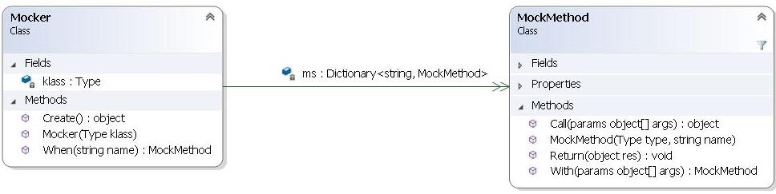

# Enunciado do Trabalho 2

**Data limite de entrega: 25 de Abril**

Pretende-se desenvolver uma biblioteca Mocky para geração dinâmica de objectos
mock (https://en.wikipedia.org/wiki/Mock_object). Os objectos mock simulam o
comportamento de objectos de tipos reais (classes ou interfaces) e são úteis na
fase de testes quando ainda não existem as implementações destes tipos.

A biblioteca Mocky pode ser usada de acordo com o exemplo seguinte para um
interface `ICalculator` resultando no comportamento apresentado:


```csharp
Mocker mock = new Mocker(typeof(ICalculator));
mock.When("Add").With(5, 7).Return(12);
mock.When("Add").With(3, 4).Return(7);
mock.When("Mul").With(3, 3).Return(9);
ICalculator calc = (ICalculator) mock.Create();
Assert.AreEqual(calc.Add(5, 7), 12);
Assert.AreEqual(calc.Add(3, 4), 7);
Assert.AreEqual(calc.Add(4, 1), 5); // FAIL !!!! returns 0 rather than 5
Assert.AreEqual(calc.Mul(3, 3), 9);
Assert.AreEqual(calc.Sub(2, 1), 1); // NotImplementedException
```

De notar que quando é chamado `calc.Add(4, 1)` é retornado 0 porque não foi
especificado em mock qual o resultado a dar para aqueles argumentos. **Logo é
retornado o valor default do tipo de retorno desse método**.

Por sua vez, para os métodos que não foi especificado qualquer comportamento
(e.g. `Sub` e `Div`) é dada a excepção `NotImplementedException`.

As classes da biblioteca Mocky têm a seguinte organização:



Como base para o desenvolvimento da biblioteca Mocky adicione à solução Wing os
projectos Mocky e MockyTest que foram adicionados ao repositório
https://github.com/isel-leic-ave/wing.

## Parte 1 --  `Mocker::Create` de `ICalculator`

Comece por implementar o **APENAS** o método `Create` de `Mocker` e verifique que na
seguinte utilização para a interface `ICalculator` é lançada a excepção
`NotImplementedException` na chamada a cada um dos seus métodos `Add`, `Sub`, `Mul` e
`Div`. Exemplo:

```csharp
Mocker mock = new Mocker(typeof(ICalculator));
ICalculator calc = (ICalculator)mock.Create();
Console.WriteLine(calc.ToString()); // > OK ToString() de Object
calc.Add(11, 8); // > throws NotImplementedException
```

Verifique que passa correctamente os testes de `TestMockerCreateOnly` de
`ICalculator`.

Admita que não existe sobrecarga de métodos. Ou seja, **NÃO existe mais que um
método com o mesmo nome**.


## Parte 2 --  `Mocker::Create` de `IRequest`

Verifique que o método `Create` de `Mocker` funciona correctamente para a
interface `IHttpRequest` da biblioteca Request lançando a excepção
`NotImplementedException` na chamada aos métodos `GetBody` e `Dispose`.

Verifique que passa correctamente os testes de `TestMockerCreateOnly` de
`IHttpRequest`.

Note que `GetMethods` da API de reflexão para uma interface só retorna os métodos
da própria interface. Neste caso deve percorrer a hierarquia de interfaces para
obter todos os métodos.

## Parte 3 --  `MockMethod`

Implemente a classe `MockMethod` de modo a verificar o seguinte caso de teste:

```csharp
MockMethod add = new MockMethod(typeof(ICalculator), "Add");
add.With(5, 3).Return(8);
add.With(2, 7).Return(9);
Assert.AreEqual(add.Call(5, 3), 8);
Assert.AreEqual(add.Call(2, 7), 9);
Assert.AreEqual(add.Call(4, 8), 0);
```

Verifique que passa correctamente o teste `TestMockMethod`.

## Parte 4 --  `Mocker` e testes para `ICalculator`

Complete o restante comportamento da classe `Mocker` e teste para a interface
`ICalculator`, verificando que passa os testes de
`TestMockerForPartialCalculator`.

**NOTA FUNDAMENTAL**: como forma de determinar qual o código IL a gerar na
implementação de cada método baseie-se no código IL compilado para a instrução `
return (int) ms[3].Call(a, b);` do método
`SimulateAddMockImplementatioToCheckIL`. O código IL a gerar será semelhante. 

## Parte 5 --  `Mocker` e testes para `IHttpRequest`

Implemente uma nova classe de testes para um mock de `IHttpRequest` com a mesma
organização que tem `TestMockerForPartialCalculator` para `ICalculator`
validando o seu correcto funcionamento.

## Parte 6 --  `Mocker` e testes para `IHttpRequest`

No projecto `WingTest` faça uma cópia de cada teste unitário para uma classe
duplicada que executa a mesma verificação mas usando um mock.

Por exemplo para `TestLoadSearchOporto` crie um segundo teste
`TestLoadSearchOportoOnMock` que substitui: `using (WeatherWebApi api = new
WeatherWebApi())` por:

```csharp
Mocker mocker = new Mocker(typeof(IWeatherWebApi));
mocker
      .When("Search")
      .With("oporto")
      .Return(new LocationInfo[] {
            null,
            null,
            null,
            null,
            null,
            new LocationInfo("Cuba", "", 0, 0)});

using (IWeatherWebApi api = (IWeatherWebApi) mocker.Create())
{ ...
```

Faça ainda uma terceira cópia para um teste ` TestLoadSearchOportoOnRequestMock`
que usa o `WeatherWebApi` sobre um mock de `IHttpRequest` da seguinte forma: 

```csharp
Mocker mocker = new Mocker(typeof(IHttpRequest));
mocker.When(...)...;
IHttpRequest req = (IHttpRequest)mocker.Create();
using (IWeatherWebApi api = new WeatherWebApi(req)) {
      ...
}
```

Repita este procedimento para todos os testes unitários de WingTest.
